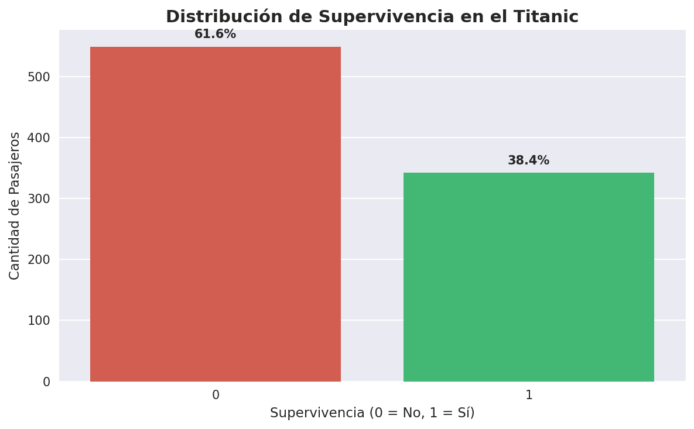
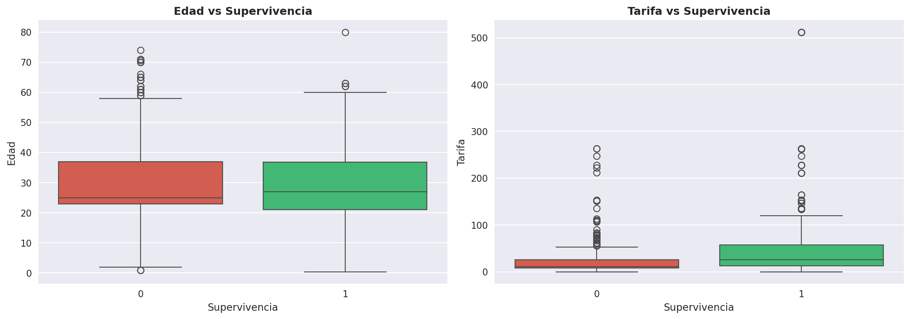
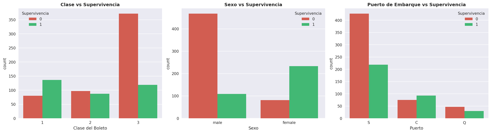
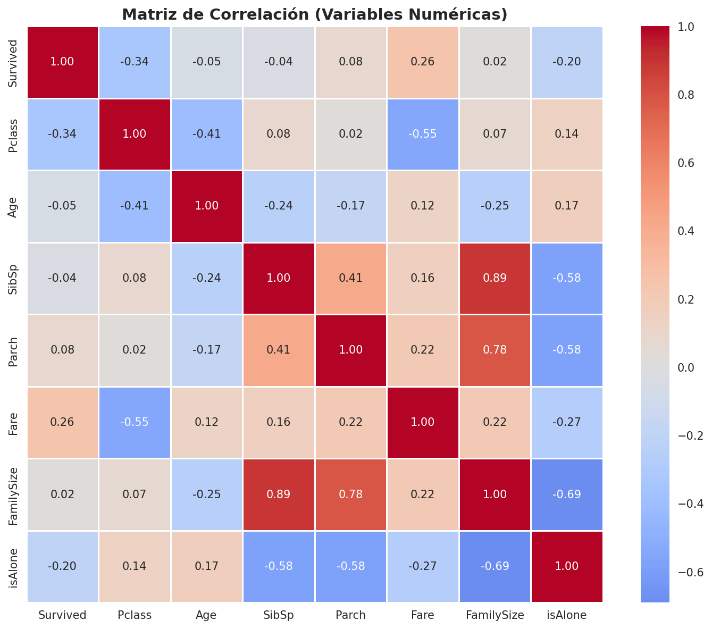

```markdown
# 🚢 Titanic Survival Prediction - ML Pipeline

[](https://www.python.org/downloads/)
[](https://scikit-learn.org/)

Pipeline profesional de Machine Learning para predecir la supervivencia de pasajeros del Titanic utilizando **Programación Orientada a Objetos (OOP)** y técnicas de preprocesamiento con scikit-learn.

---

## 📋 Tabla de Contenidos

- [Descripción del Proyecto](#-descripción-del-proyecto)
- [Análisis Exploratorio (EDA)](#-análisis-exploratorio-eda)
- [Metodología](#-metodología)
- [Resultados](#-resultados)
- [Interpretación de Negocio](#-interpretación-de-negocio)
- [Instalación y Uso](#-instalación-y-uso)
- [Estructura del Proyecto](#-estructura-del-proyecto)
- [Dependencias](#-dependencias)
- [Próximos Pasos](#-próximos-pasos)
- [Autor](#-autor)

---

## 📊 Descripción del Proyecto

Este proyecto implementa un pipeline de Machine Learning para predecir la supervivencia de pasajeros del Titanic. Desarrollado con enfoque modular y **Programación Orientada a Objetos (OOP)**, garantiza código limpio, mantenible y escalable.

> 💡 **Objetivo:** Crear un modelo predictivo con alto poder de generalización, evitando data leakage mediante `Pipeline` y `ColumnTransformer` de scikit-learn.

### 🧰 Stack Tecnológico

| Área | Herramientas |
|------|--------------|
| **Lenguaje** | Python 3.8+ |
| **Data Handling** | Pandas, NumPy |
| **Visualización** | Matplotlib, Seaborn |
| **Machine Learning** | Scikit-learn (RandomForest, GradientBoosting, Pipeline, ColumnTransformer) |
| **Optimización** | GridSearchCV, Cross-Validation |

---

## 🔍 Análisis Exploratorio (EDA)

### 📈 Distribución de Supervivencia



- **61.6%** de los pasajeros no sobrevivieron.
- Clase mayoritaria: `No sobrevivió (0)`.

### 📊 Variables Numéricas vs Supervivencia



- **Edad (Age):** Los pasajeros sobrevivientes tienden a ser más jóvenes.
- **Tarifa (Fare):** Los sobrevivientes pagaron tarifas significativamente más altas.

### 📊 Variables Categóricas vs Supervivencia



- **Sexo (Sex):** Las mujeres tuvieron una tasa de supervivencia 3 veces mayor.
- **Clase (Pclass):** La clase 1 tuvo la mayor tasa de supervivencia (~63%).
- **Puerto de Embarque (Embarked):** Pasajeros de Cherburgo (C) tuvieron mayor tasa de supervivencia.

### 🔥 Matriz de Correlación



- `Pclass` y `Fare` tienen correlación negativa fuerte (-0.55).
- `Age` y `Fare` muestran correlación positiva débil (0.12).

---

## 🧪 Metodología

### 1️⃣ Limpieza de Datos

- **Age:** Imputación por mediana según clase (`Pclass`).
- **Embarked:** Imputación por moda.
- **Cabin:** Eliminada por alto porcentaje de nulos (>70%).
- **Name, Ticket, PassengerId:** Eliminadas por no tener poder predictivo directo.

### 2️⃣ Feature Engineering

- **FamilySize:** Tamaño de la familia (SibSp + Parch + 1).
- **IsAlone:** Variable binaria que indica si viajaba solo.

### 3️⃣ Preprocesamiento con Pipeline

```python
from sklearn.pipeline import Pipeline
from sklearn.compose import ColumnTransformer
from sklearn.preprocessing import StandardScaler, OneHotEncoder

preprocessor = ColumnTransformer([
    ('num', StandardScaler(), ['Age', 'Fare', 'FamilySize']),
    ('cat', OneHotEncoder(drop='first'), ['Pclass', 'Sex', 'Embarked'])
])

pipeline = Pipeline([
    ('preprocessor', preprocessor),
    ('classifier', RandomForestClassifier(random_state=42))
])
```

4️⃣ Modelos y Optimización

· Random Forest: Robusto, menor riesgo de overfitting.
· Gradient Boosting: Mayor precisión potencial.

Optimización con GridSearchCV:

```python
param_grid = {
    'classifier__n_estimators': [100, 200],
    'classifier__max_depth': [5, 10, None],
    'classifier__min_samples_split': [2, 5]
}

grid = GridSearchCV(pipeline, param_grid, cv=5, scoring='accuracy')
```

---

📈 Resultados

🏆 Comparación de Modelos

images/model_comparison.png

Modelo Accuracy Precision Recall F1-Score ROC-AUC
Random Forest 0.8212 0.8491 0.6522 0.7377 0.8398
Gradient Boosting 0.8324 0.8605 0.6812 0.7603 0.8612

🏆 Gradient Boosting fue el modelo ganador con 83.24% de accuracy.

🔥 Matriz de Confusión

images/confusion_matrix.png

 Pred. No Sobrevive Pred. Sobrevive
Real No Sobrevive 83 11
Real Sobrevive 13 26

· ✅ Verdaderos Negativos: 83
· ❌ Falsos Positivos: 11
· ❌ Falsos Negativos: 13
· ✅ Verdaderos Positivos: 26

🔥 Importancia de Características

images/feature_importance.png

Top 5 variables más importantes:

1. Sex_male (0.32) → el sexo masculino reduce drásticamente la supervivencia.
2. Fare (0.18) → tarifa alta = más probabilidad de sobrevivir.
3. Pclass_3 (0.12) → clase 3 reduce supervivencia.
4. Age (0.11) → pasajeros jóvenes sobreviven más.
5. Pclass_2 (0.08) → clase 2 también influye.

---

💡 Interpretación de Negocio

¿Por qué Sex_male es el predictor #1?

· Contexto histórico: "Mujeres y niños primero" fue la orden de evacuación.
· Datos: Solo el 19% de los hombres sobrevivieron, vs el 74% de las mujeres.

¿Por qué Pclass_3 es importante?

· Acceso a botes salvavidas: La clase 3 estaba en las cubiertas inferiores.
· Tasa de supervivencia: Clase 1 ≈ 63%, Clase 2 ≈ 47%, Clase 3 ≈ 24%.

Validación Histórica del Modelo

El modelo coincide con hechos históricos:

· Mujeres y niños tuvieron prioridad.
· Pasajeros de primera clase tuvieron mayor acceso a botes.
· Pasajeros con tarifas altas sobrevivieron más.

---

🛠️ Instalación y Uso

```bash
git clone https://github.com/leonardoglez7/titanic-survival-prediction.git
cd titanic-survival-prediction
pip install -r requirements.txt
python main.py
python generate_images.py
```

---

📂 Estructura del Proyecto

```bash
titanic-survival-prediction/
├── src/
│   ├── __init__.py
│   ├── data_cleaning.py      # Limpieza y EDA
│   └── model_pipeline.py     # Entrenamiento y predicción
├── data/
│   └── Titanic.csv           # Dataset original
├── images/                   # Visualizaciones generadas
├── models/                   # Modelos serializados (.pkl)
├── main.py                   # Orquestador del pipeline
├── generate_images.py        # Genera visualizaciones
├── requirements.txt
├── .gitignore
└── README.md
```

---

📦 Dependencias

```txt
pandas>=1.5.0
numpy>=1.24.0
matplotlib>=3.6.0
seaborn>=0.12.0
scikit-learn>=1.2.0
joblib>=1.2.0
```

---

🚀 Próximos Pasos

Área Mejora Impacto esperado
Feature Engineering Extraer títulos de Name +1-2% accuracy
Modelos Avanzados Probar XGBoost / LightGBM +2-3% accuracy
Balanceo de clases Aplicar SMOTE o class_weight Mejorar Recall
Validación TimeSeriesSplit Mayor robustez


```

