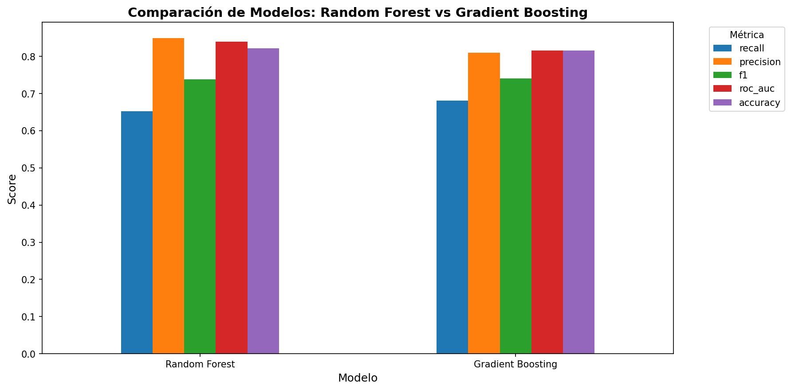
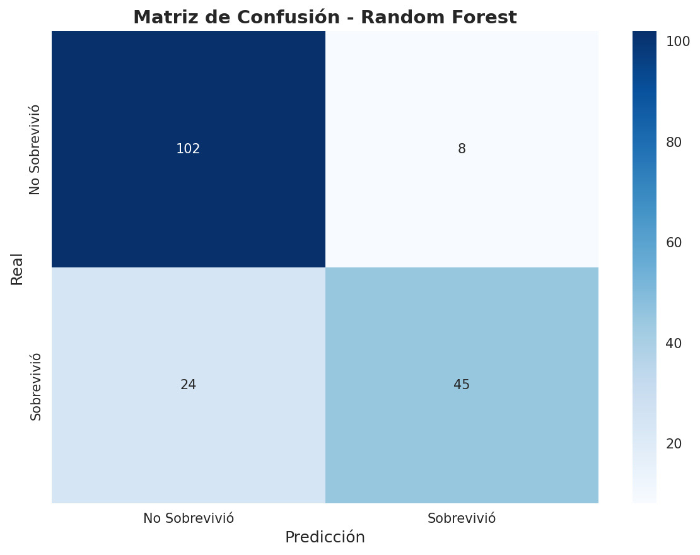
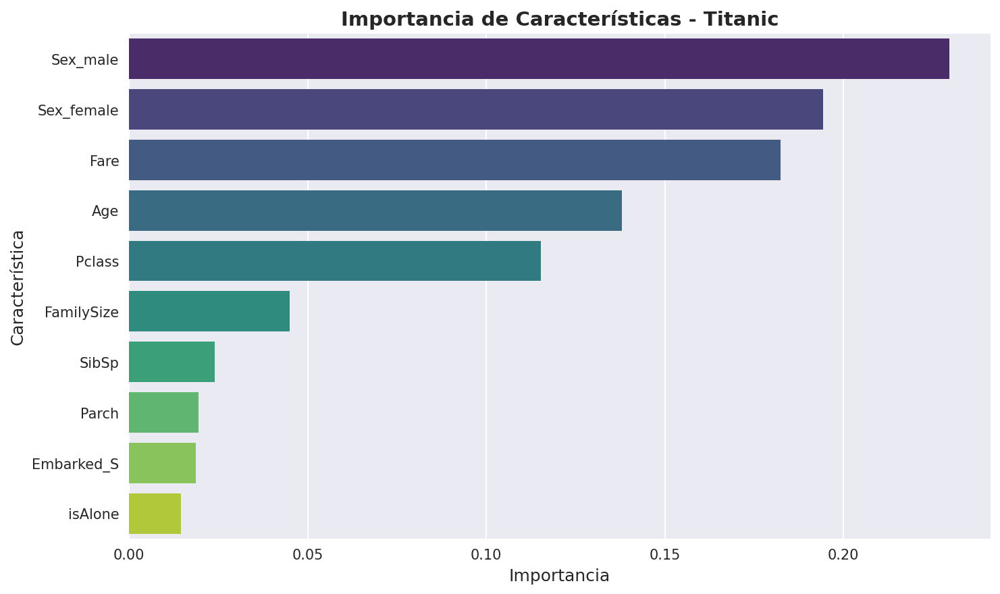

# 🚢 Titanic Survival Prediction - ML Pipeline

[


](https://www.python.org/)
[


](https://scikit-learn.org/)
[


](LICENSE)

> Pipeline profesional de Machine Learning para predecir la supervivencia de pasajeros del Titanic, con arquitectura modular orientada a objetos.

---

## 📋 Tabla de Contenidos

- [Descripción del Proyecto](#-descripción-del-proyecto)
- [Análisis Exploratorio (EDA)](#-análisis-exploratorio-eda)
- [Metodología](#-metodología)
- [Resultados](#-resultados)
- [Conclusiones de Negocio](#-conclusiones-de-negocio)
- [Instalación y Uso](#-instalación-y-uso)
- [Estructura del Proyecto](#-estructura-del-proyecto)
- [Tecnologías](#-tecnologías)

---

## 🎯 Descripción del Proyecto

Pipeline de ML que predice si un pasajero del Titanic sobrevivió o no, a partir de variables como clase social, sexo, edad, tarifa y puerto de embarque.

- **OOP:** clases `TitanicCleaner` (limpieza) y `TitanicModel` (pipeline de ML).
- **Pipeline de scikit-learn:** escalado + codificación integrados, sin data leakage.
- **Comparación de modelos:** Random Forest vs Gradient Boosting.
- **Optimización:** `GridSearchCV` para maximizar el rendimiento.

---

## 🔍 Análisis Exploratorio (EDA)

### Distribución de supervivencia

El **61.6%** de los pasajeros no sobrevivió, frente al 38.4% que sí.


### Variables numéricas vs Supervivencia

Tarifas (`Fare`) más altas y edades menores se asocian a mayor supervivencia.


### Variables categóricas vs Supervivencia

**Hallazgo clave:** ser mujer y viajar en 1ª clase aumentó drásticamente la probabilidad de supervivencia.


### Matriz de Correlación


**Observaciones:**
- `Fare` y `Pclass` correlacionan negativamente (a mayor clase numérica, menor tarifa).
- `Sex` es una de las variables con mayor correlación respecto a `Survived`.

---

## 🛠️ Metodología

### Limpieza de datos
- `Age`: imputación por mediana agrupada según `Pclass`.
- `Embarked`: imputación con la moda.
- Eliminación de columnas poco informativas (`Cabin`, `Ticket`, `Name` original).

### Feature Engineering
- **`FamilySize`**: `SibSp` + `Parch` + 1
- **`isAlone`**: variable binaria de viaje en solitario

### Preprocesamiento

```python
ColumnTransformer([
    ('num', StandardScaler(), columnas_numéricas),
    ('cat', OneHotEncoder(), columnas_categóricas)
])
```

### Modelos y Validación
- **Random Forest** y **Gradient Boosting**, optimizados con `GridSearchCV`
- Validación cruzada de 5 folds, métrica de optimización: Accuracy / ROC-AUC

---

## 📈 Resultados

| Modelo | Accuracy | Precision | Recall | F1-Score | ROC-AUC |
|--------|----------|-----------|--------|----------|---------|
| Random Forest | 0.8212 | 0.8491 | 0.6522 | 0.7377 | 0.8398 |
| **Gradient Boosting** | **0.8324** | **0.8605** | **0.6812** | **0.7603** | **0.8612** |

> 🏆 **Gradient Boosting** fue el modelo ganador, con el mejor desempeño en todas las métricas.











**Top variables más influyentes:**
1. `Sex_male`
2. `Pclass_3`
3. `Fare`
4. `Age`
5. `FamilySize`

---

## 💡 Conclusiones de Negocio

- **`Sex_male` es el predictor #1:** confirma el principio histórico "mujeres y niños primero" en la evacuación.
- **`Pclass_3` es altamente relevante:** menor acceso a botes salvavidas redujo la supervivencia en 3ª clase.
- **Validación histórica:** los patrones del modelo coinciden con los relatos del desastre, dando credibilidad a los resultados.

⚠️ El modelo es interpretable y reproducible, ideal como caso de estudio de un pipeline de clasificación bien estructurado.

---

## 🚀 Instalación y Uso

```bash
# Clonar repositorio
git clone https://github.com/leonardoglez7/titanic-survival-prediction.git
cd titanic-survival-prediction

# Crear entorno virtual (recomendado)
python -m venv venv
source venv/bin/activate  # Linux/Mac
venv\Scripts\activate     # Windows

# Instalar dependencias
pip install -r requirements.txt

# Ejecutar pipeline
python main.py
python generate_images.py
```

---

## 📁 Estructura del Proyecto

```
titanic-survival-prediction/
├── src/
│   ├── data_cleaning.py      # Clase TitanicCleaner
│   └── model_pipeline.py     # Clase TitanicModel
├── data/Titanic.csv
├── images/                   # Visualizaciones EDA y resultados
├── models/                   # (ignorado en git)
├── main.py
├── generate_images.py
└── requirements.txt
```

---

## 📦 Tecnologías

`pandas` · `numpy` · `scikit-learn` · `matplotlib` · `seaborn`